30 day CSS Coding Challenge

To run any of this examples, move to the directory 'Day#', and run Live Server in VSC.  

|                                                                                                       |                                                                                                                                                                         |                                                                                                                                                                         |
| :---------------------------------------------------------------------------------------------------: | :---------------------------------------------------------------------------------------------------------------------------------------------------------------------: | :---------------------------------------------------------------------------------------------------------------------------------------------------------------------: |
|  
<a href="./Days/Day1/">Day 1</a>
 |                                   
<a href="./Days/Day2/">Day 2</a>
                                  |                                  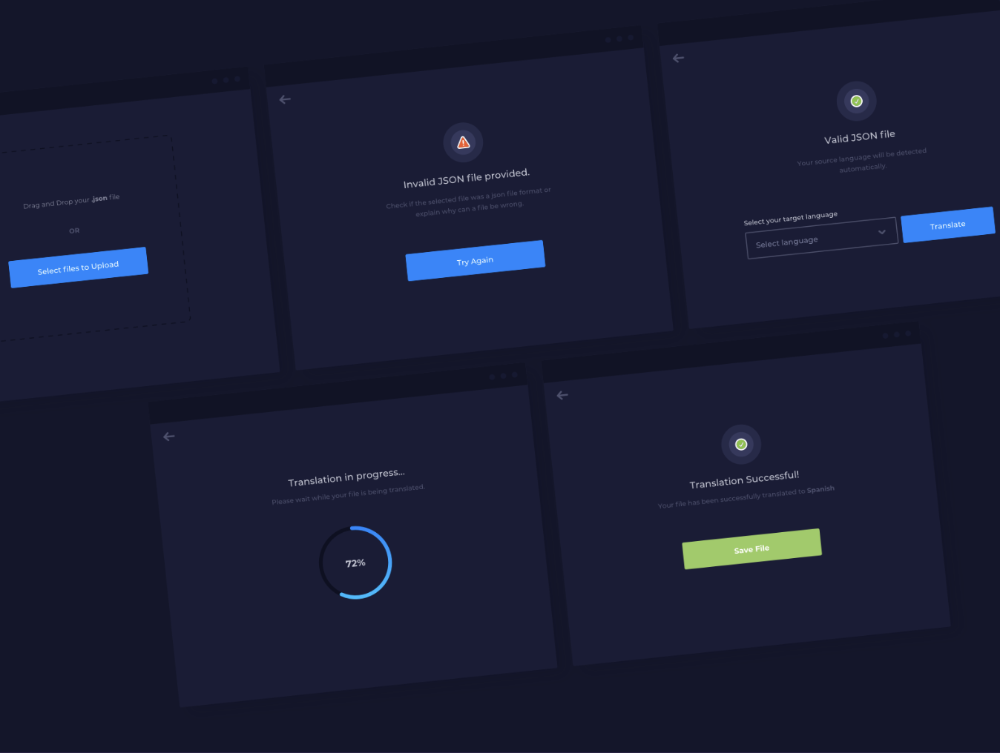
<a href="./Days/Day3/">Day 3</a>
                                   |
| 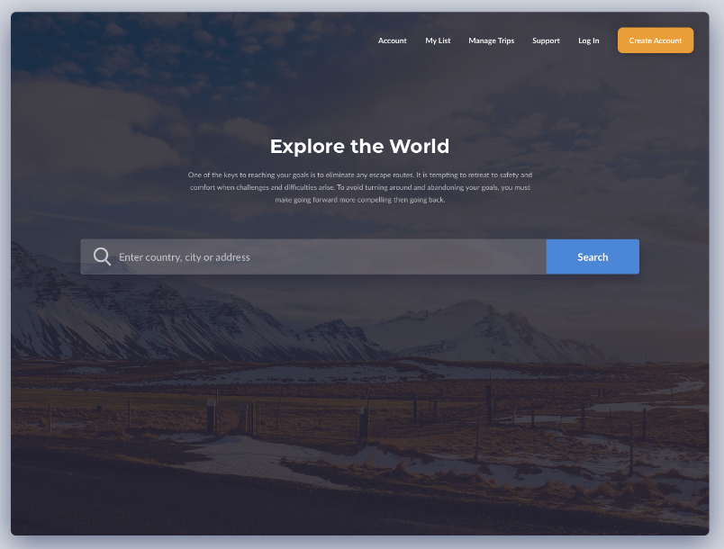
<a href="./Days/Day4/">Day 4</a>
  |                                  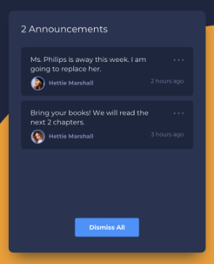
<a href="./Days/Day5/">Day 5</a>
                                   |                                  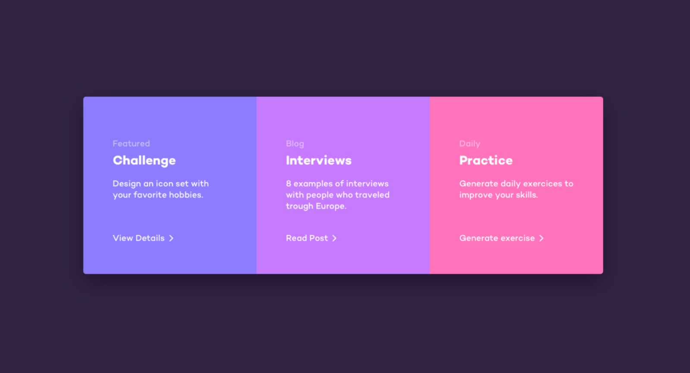
<a href="./Days/Day6/">Day 6</a>
                                  |
| 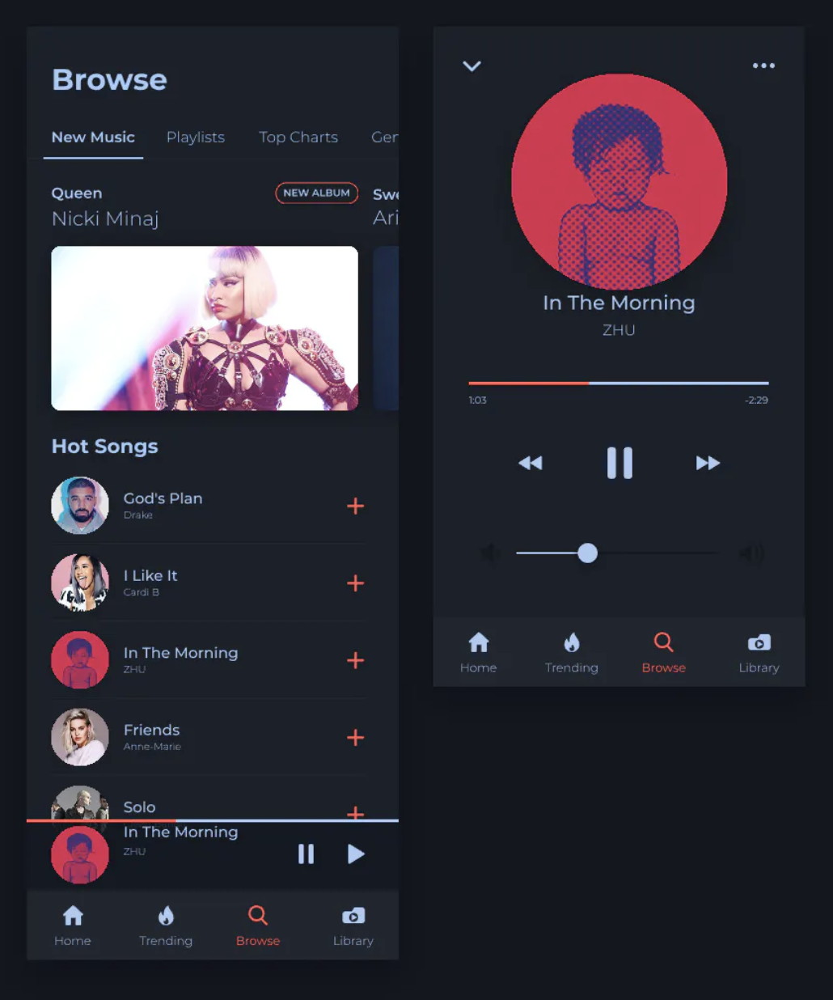
<a href="./Days/Day7/">Day 7</a>
  |                                  
<a href="./Days/Day8/">Day 8</a>
                                   |                                  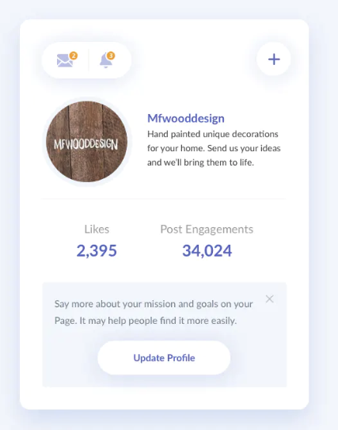
<a href="./Days/Day9/">Day 9</a>
 
|                                  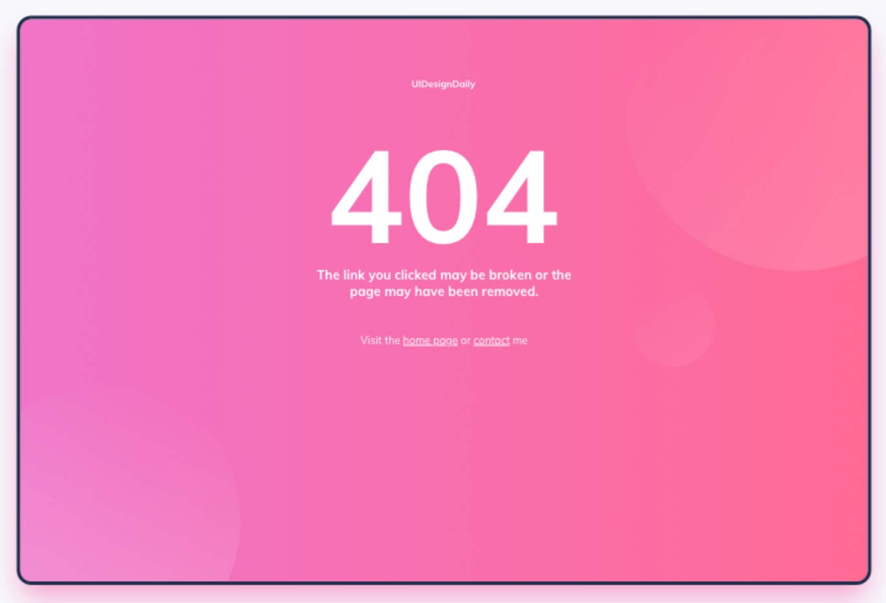
<a href="./Days/Day10/">Day 10</a>
 |                                  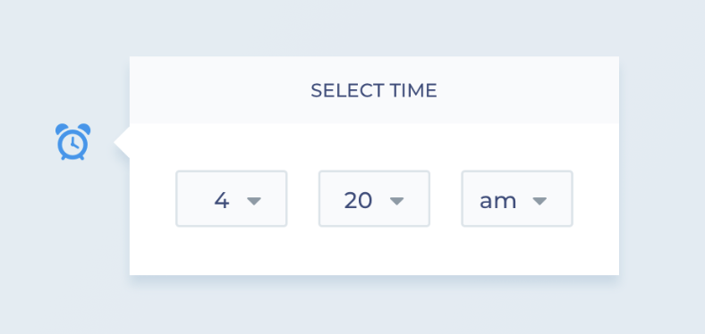
<a href="./Days/Day11/">Day 11</a>
 |                                  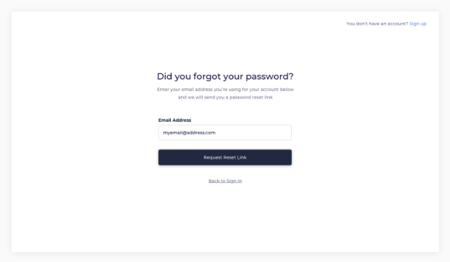
<a href="./Days/Day12/">Day 12</a>
 |
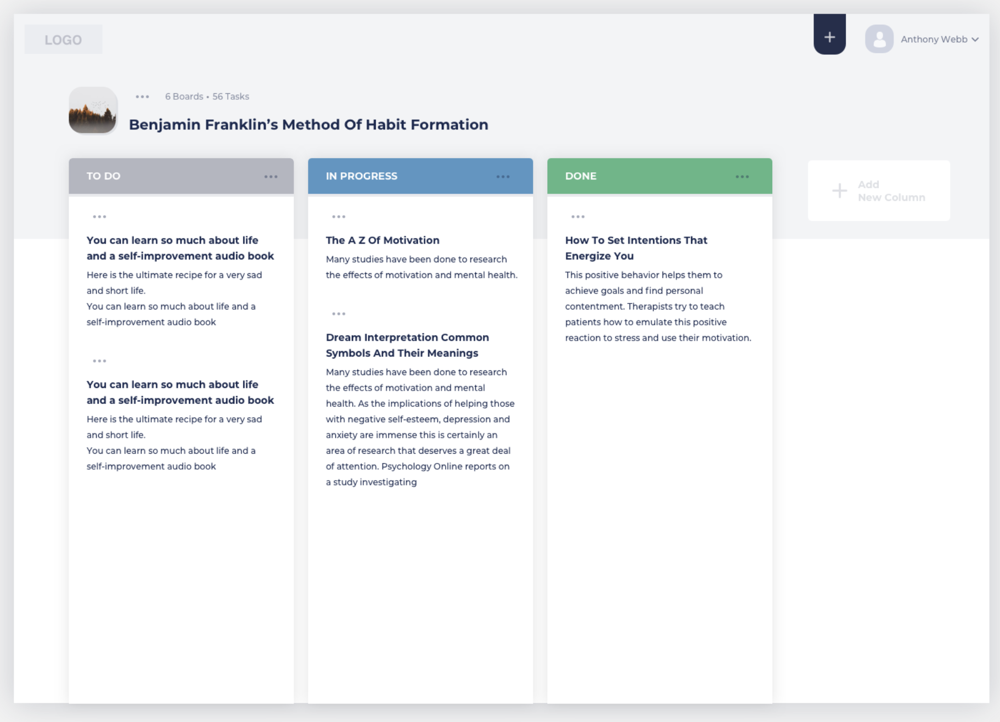
<a href="./Days/Day13/">Day 13</a>
 |                                  
<a href="./Days/Day14/">Day 14</a>
 |                                  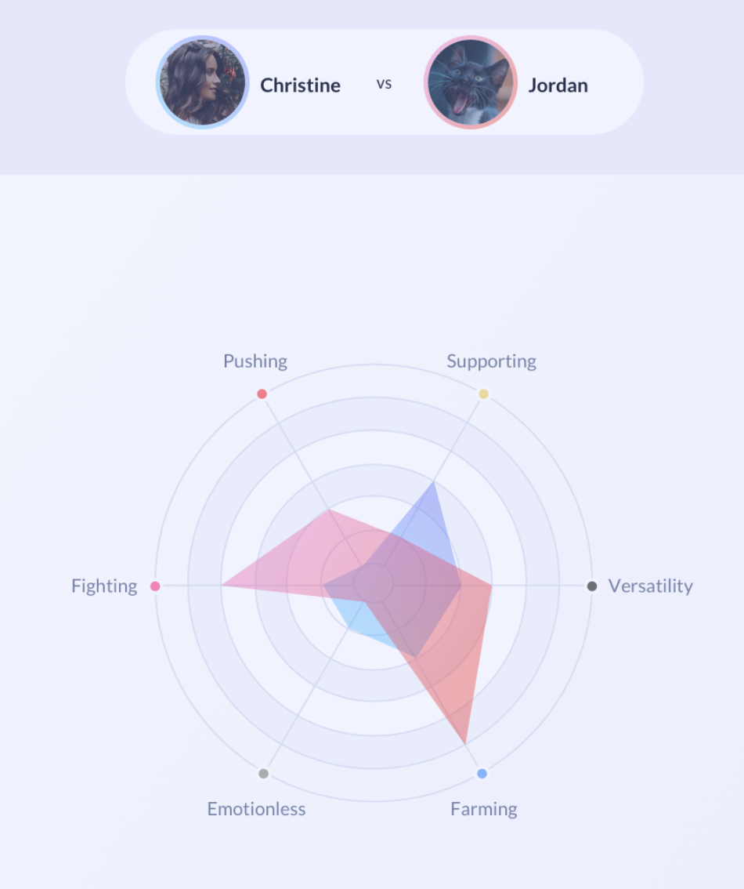
<a href="./Days/Day15/">Day 15</a>
 |
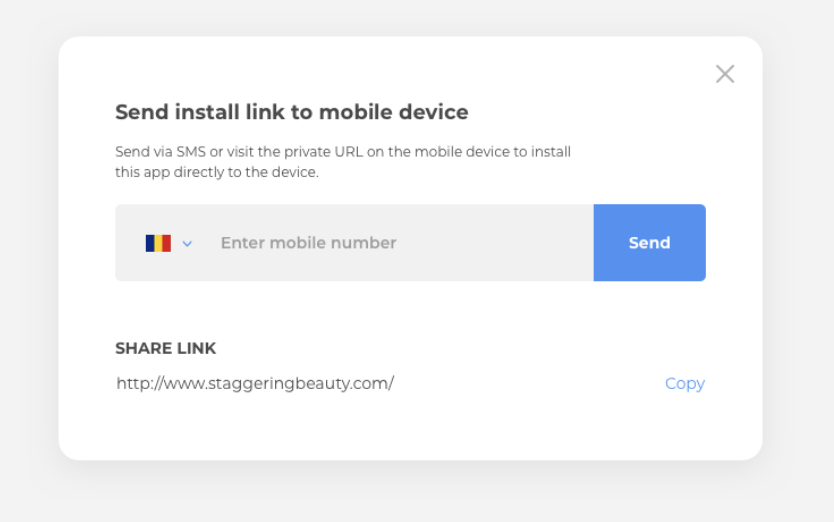
<a href="./Days/Day16/">Day 16</a>
                                  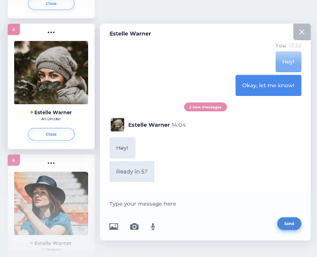
<a href="./Days/Day17/">Day 17</a>
 |                                  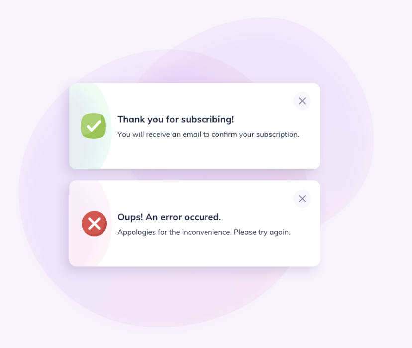
<a href="./Days/Day18/">Day 18</a>
 |

