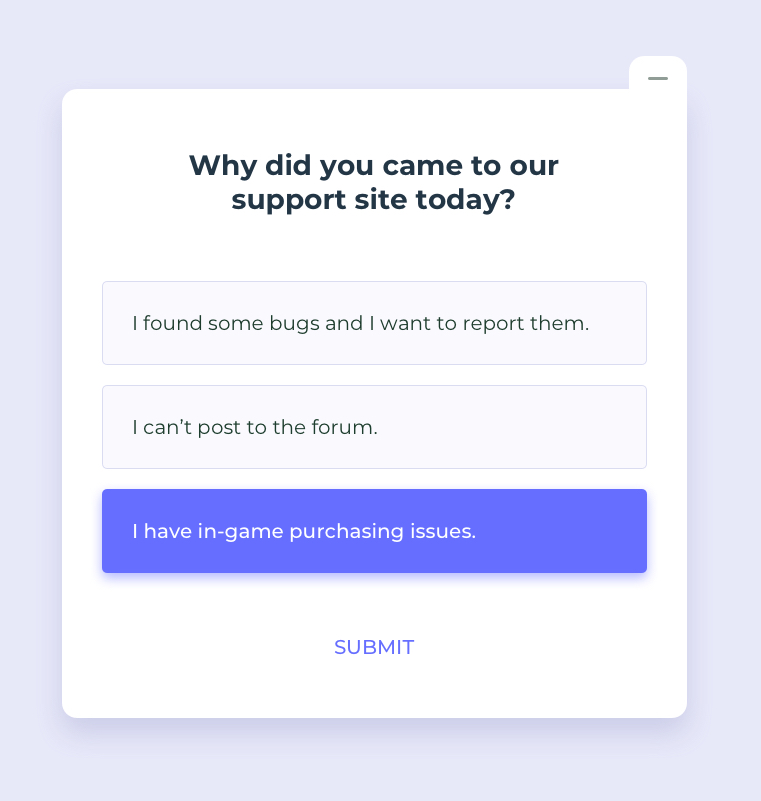
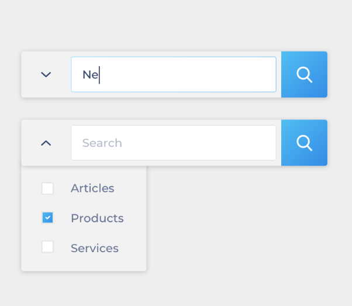
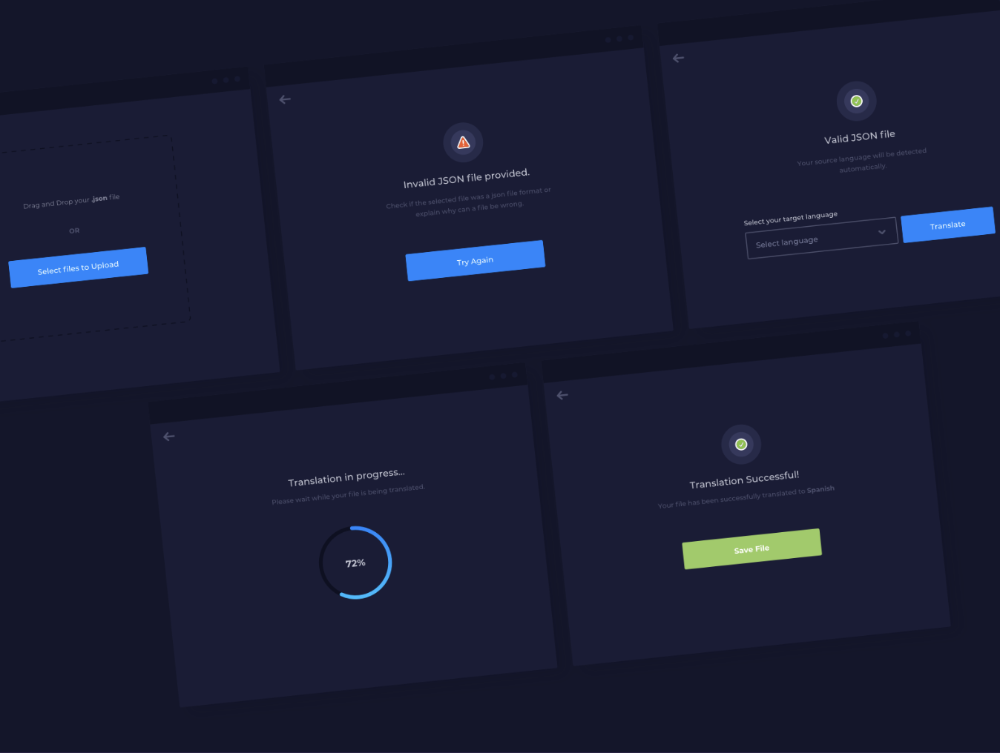
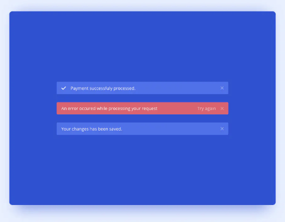
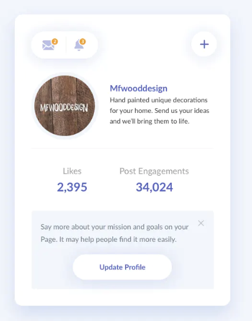
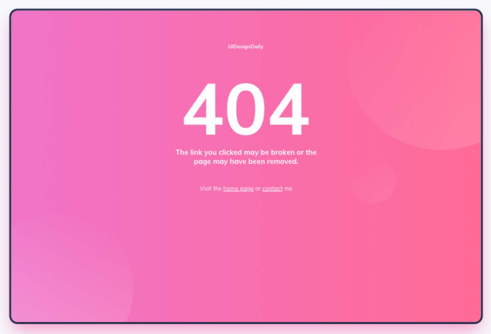
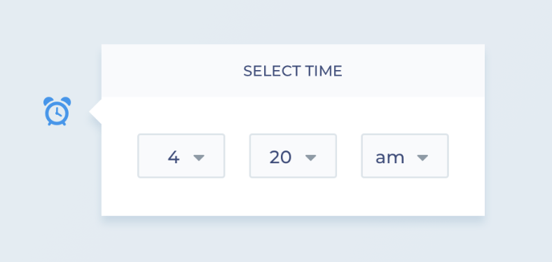

# 30 days CSS Coding Challenge

To run any of this examples, move to the directory 'Day#', and run Live Server in VSC.  

|                                                                                                       |                                                                                                                                                                         |                                                                                                                                                                         |
| :---------------------------------------------------------------------------------------------------: | :---------------------------------------------------------------------------------------------------------------------------------------------------------------------: | :---------------------------------------------------------------------------------------------------------------------------------------------------------------------: |
|  
<a href="./Day#/Day1/">Day 1</a>
 |                                   
<a href="./Day#/Day2/">Day 2</a>
                                  |                                  
<a href="./Day#/Day3/">Day 3</a>
                                   |
| 
<a href="./Day#/Day4/">Day 4</a>
  |                                  
<a href="./Day#/Day5/">Day 5</a>
                                   |                                  
<a href="./Day#/Day6/">Day 6</a>
                                  |
| 
<a href="./Day#/Day7/">Day 7</a>
  |                                  
<a href="./Day#/Day8/">Day 8</a>
                                   |                                  
<a href="./Day#/Day9/">Day 9</a>
 |                                  
<a href="./Day#/Day10/">Day 10</a>
 |                                  
<a href="./Day#/Day11/">Day 11</a>
 |                                  
<a href="./Day#/Day12/">Day 12</a>
 |
